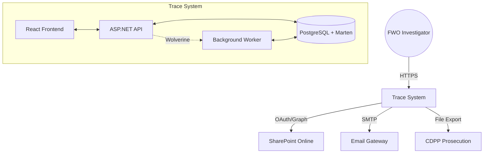
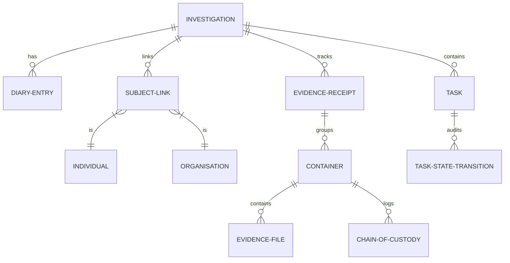
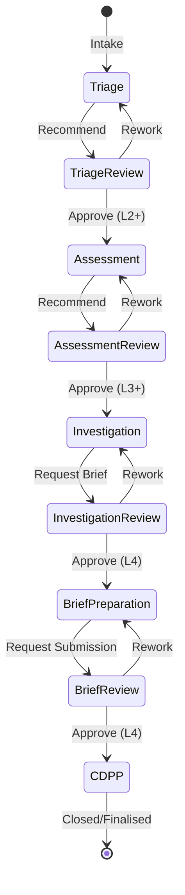
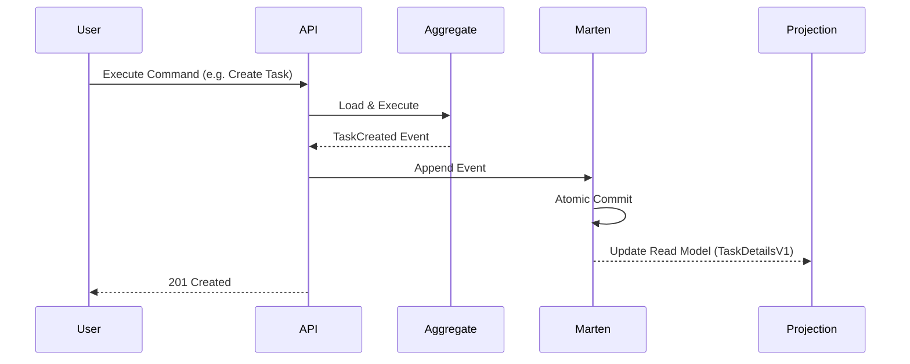
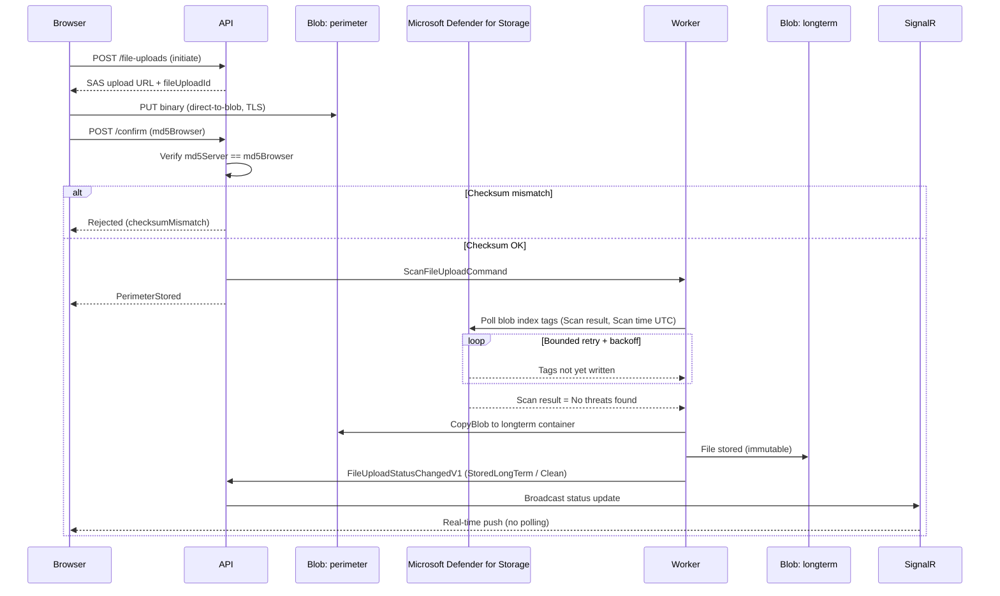
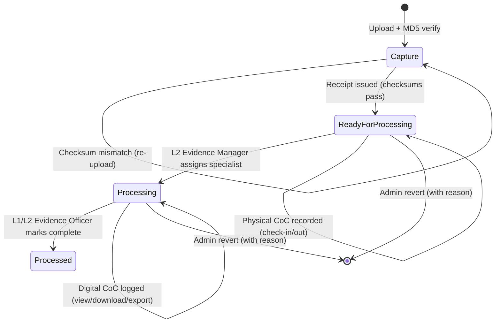
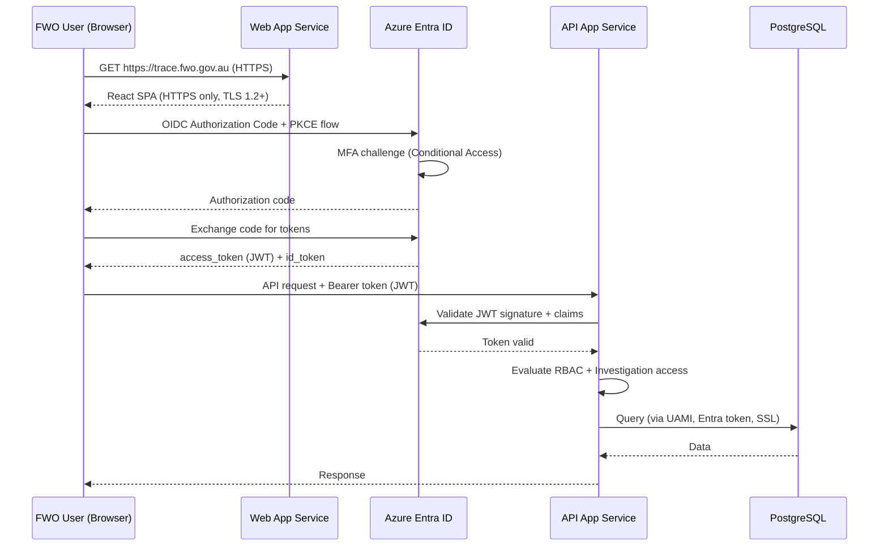
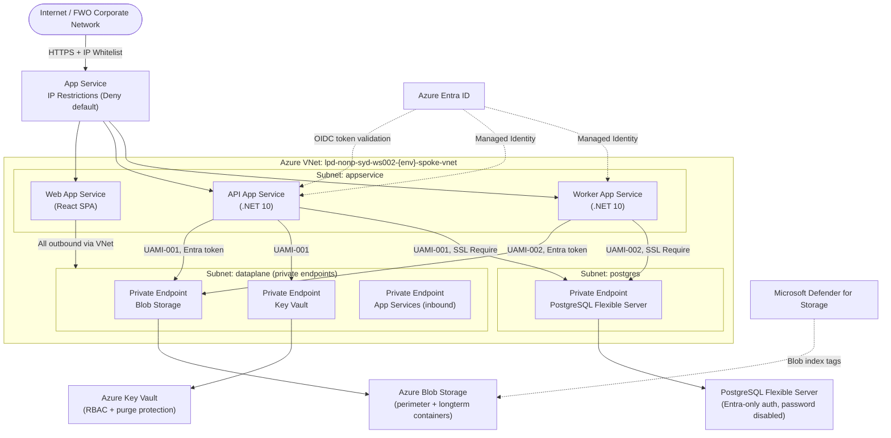

# Trace System Overview

**Trace** is a high-integrity criminal investigation and case management platform built for the **Fair Work Ombudsman (FWO)**. It provides a secure, defensible environment for managing the end-to-end lifecycle of workplace law investigations, from initial triage to prosecution by the Commonwealth Director of Public Prosecutions (CDPP).

---

## 1. Business Context & Vision

The primary mission of Trace is to enable FWO investigators to build legally robust cases against wage theft and other serious workplace contraventions. The system emphasises **auditability**, **temporal accuracy**, and **evidence integrity**.

### Core Capabilities
- **Investigation Container**: A central "hub" for all related subjects, evidence, tasks, and decisions.
- **Event-Sourced Audit**: Every change is captured as a domain event, providing a perfect chronological history.
- **Evidence Management**: Full chain-of-custody tracking for both physical and digital evidence.
- **Workflow Governance**: Multi-level approval gates (L1–L4) for critical milestones.
- **M365 Integration**: Automated provisioning of SharePoint sites for document storage and collaboration.

### Stakeholders

| Stakeholder | Role | Primary Concern |
| :--- | :--- | :--- |
| **FWO Executive Director (L4)** | System owner; grants final prosecutorial approvals | Legal defensibility; authorisation model integrity |
| **FWO Directors (L3)** | Departmental oversight; approve investigations for prosecution brief preparation | Workflow governance; case prioritisation visibility |
| **FWO Assistant Directors (L2)** | Team leads; first-level approvers; manage investigator workloads | Diary, task, and evidence completeness |
| **FWO Investigators (L1)** | Primary users; conduct day-to-day investigation activities | Usability; diary and evidence capture efficiency |
| **FWO Evidence Officers (L1/L2)** | Manage physical and digital evidence receipts and chain of custody | Evidence integrity; processing queue accuracy |
| **FWO Legal Counsel** | Access LPP-flagged evidence; advise on prosecution decisions | LPP access controls; legal defensibility of evidence |
| **CDPP** | Receives prosecution briefs from FWO | Completeness and accuracy of brief submissions |
| **Trace Administrator** | Manages users; performs emergency state reverts | System stability; user provisioning |
| **FWO ICT / Platform Team** | Operates the Azure platform and CI/CD pipeline | Availability; security posture; deployment reliability |

---

## 2. System Architecture

Trace follows a modern, distributed architecture designed for scalability and maintainability.

### High-Level Context



### Technical Stack

| Layer | Technology |
| :--- | :--- |
| **Frontend** | React 19, TypeScript, Vite, Tailwind CSS, ShadCN UI |
| **Backend** | .NET 10, Wolverine (Mediator & Messaging) |
| **Persistence** | PostgreSQL 17 + Marten (Event Sourcing & Document DB) |
| **File Storage** | Azure Blob Storage (immutable evidence files) |
| **Orchestration** | .NET Aspire (Local), Azure App Service (Cloud) |
| **Infrastructure** | Azure (PostgreSQL Flexible Server, KeyVault, App Configuration, Blob Storage) |
| **IaC** | Azure Pipelines + custom deploy scripts (Terraform planned) |
| **Testing** | xUnit, Alba, Testcontainers, Playwright, Vitest |

---

## 3. Domain Model & Lifecycle

The system is "Investigation-Centric". Almost every entity in the system is scoped to a specific Investigation.

### Core Entities



### Investigation Lifecycle

Investigations progress through formal stages, each requiring specific data and approvals.



---

## 4. Implementation Patterns

### Event Sourcing with Marten

Trace uses [Marten](https://martendb.io/) to implement an event-sourced backend. Instead of just storing the current state, we store the sequence of events that led to that state.



### Vertical Slice Architecture

The codebase is organised by feature, not by technical layer. Each feature folder contains its own endpoints, commands, events, and projections.

- **Backend**: `src/api/Trace.Api/Features/{FeatureName}/`
- **Frontend**: `src/presentation/src/features/{feature-name}/`

### Audit & Immutability

All critical history tables are **append-only** (no updates or deletes) to ensure legal defensibility:

| Table | Purpose |
| :--- | :--- |
| `state_transitions` | Investigation workflow changes |
| `evidence_state_transitions` | Evidence processing state changes |
| `task_state_transitions` | Task lifecycle changes |
| `physical_chain_of_custody` | Physical evidence movements |
| `digital_chain_of_custody` | Digital evidence interactions (view, download, export) |
| `diary_entries` | Chronological investigation log |

Corrections to mutable facts (e.g., contact details) are modelled as new domain events that update the read projection — old events are never removed from the stream (ADR-008).

### File Upload & Malware Scan Pipeline

Evidence files follow a multi-stage pipeline with **Microsoft Defender for Storage** performing on-upload malware scanning before a file is promoted to long-term storage. The Worker drives scan-result acquisition via blob-tag polling (no Event Grid dependency).



**Upload states**: `Pending → Uploading → PerimeterStored → Scanning → ScanPassed → StoredLongTerm`  
**Terminal failure states**: `Rejected` (checksum mismatch / cancel), `ScanFailed` (Infected / Error / NotScanned), `Failed` (pipeline error)  
**Download**: Only permitted when `uploadState = StoredLongTerm` AND `scanResult = Clean`; returns a short-lived (5-minute) read-only SAS URL.

> ⚠️ **Gap (P07)**: `npm audit` is disabled in CI (`NPM_CONFIG_AUDIT: "false"`). Defender for Storage scan results are also forwarded to the central SOC Log Analytics Workspace (`ScanResults` log category) for Sentinel enrichment, but this path is observability-only and not a runtime dependency.

### Evidence Lifecycle

Evidence within an investigation follows a defined processing lifecycle with role-gated transitions:



**Chain of Custody**: Every state change and every file interaction (view, download, export, LPP toggle) is written to an immutable `digital_chain_of_custody` record with timestamp, user, IP address, and device.  
**LPP**: Files flagged `lppFlag = true` are hidden from all roles except `Legal` and `Trace Admin` until explicitly cleared with audit capture.

---

## 5. Security & Access Control

### Role-Based Access (RBAC)

Roles are hierarchical and determine what actions a user can perform:

| Role | Key Permissions |
| :--- | :--- |
| **L1 Investigator** | Create and update records in active work states (Triage, Assessment, Investigation) |
| **L2 Assistant Director** | All Investigator permissions + first-level approvals; team oversight |
| **L3 Director** | All L2 permissions + second-level approvals; Director-escalated case decisions |
| **L4 Executive Director** | All L3 permissions + final prosecution and high-impact warrant approvals |
| **L1 Evidence Officer** | Upload files, initiate containerisation, update evidence status |
| **L2 Evidence Manager** | Assign specialists, manage the evidence processing queue |
| **Legal** | Access LPP-flagged evidence (restricted to Legal + Admin until cleared) |
| **Trace Admin** | System-level maintenance, user management, emergency state reverts |

### "Need to Know" Security

Access is restricted at the Investigation level. Even with a high-level role, a user must be on the **User Access List** for a specific Investigation to view or modify its contents. This list is synchronised with SharePoint permissions to ensure consistency across data and documents.

Investigations also support an **Exclusion List** (`InvestigationUserExclusionLink`) — a named user can be explicitly blocked from an investigation even if they would otherwise qualify by role or team membership.

### Authentication

| Environment | Mechanism |
| :--- | :--- |
| **Production (target)** | Azure Active Directory / Entra ID — OIDC with JWT Bearer tokens; MFA enforced via Conditional Access |
| **Non-prod (dev / test)** | `TRACE_AUTH_MODE: user-picker` — persona picker for testing only; **must be changed to `entra` before production deployment** |
| **Local** | Custom dev-mode persona picker; issues a signed JWT via `POST /api/v1/auth/token`; **strictly gated to the `Local` environment name** — the dev issuer is rejected in production configuration |

#### Production Authentication Flow



> ⚠️ **Gap (P01)**: Non-prod environments currently use `TRACE_AUTH_MODE: user-picker`. This **must** be replaced with the Entra OIDC flow above for staging and production. Switching this is a **release blocker** for the April go-live.

#### IP Access Restrictions (Whitelist)
All App Services and backend resources enforce a **deny-by-default** inbound rule. Only the following ranges are whitelisted:
- **FWO Corporate Network**: `165.12.252.96/27`, `165.12.207.111/32`, `165.12.207.112/32`
- **Developer Cloud PCs (WS001)**: `68.218.21.43/32`

The frontend uses a custom `AuthProvider` with:
- `localStorage` token storage scoped per auth session.
- Silent token renewal with a 401 intercept in `apiFetch`.
- Protected query cache recreated on login/logout/user switch to prevent cross-session data leakage.

### Authorisation & Identity

- **Backend**: ASP.NET Core `IAuthorizationService` with `{Feature}AuthorizationRules.cs` as the single source of truth per feature.
- **Managed Identity**: 4 separate User-Assigned Managed Identities (UAMIs) provide least-privilege isolation — one each for API, Worker, PostgreSQL administration, and Blob Storage. System-assigned identities are disabled on compute.
- **Database**: Entra-managed role groups (`pg-reader`, `pg-contributor`) govern access. `password_auth_enabled: false` enforces passwordless-only auth for all Azure-hosted environments.
- **Key Vault**: RBAC-based authorisation (`enable_rbac_authorization: true`); purge protection enabled with 90-day soft-delete to prevent accidental or malicious secret deletion.
- **Storage**: Shared Access Keys disabled (`shared_access_key_enabled: false`); all storage access is via UAMIs and Entra tokens.
- **Frontend**: [CASL](https://casl.js.org/) (`@casl/ability`) consuming the ability set returned by `/api/v1/auth/me`. The `<Can>` component controls UI rendering based on server-delegated permissions.

### Legal Professional Privilege (LPP)

Evidence files can be flagged with `lppFlag = true`. Until the flag is cleared:
- Access is restricted to `Legal` and `Trace Admin` roles.
- Clearing is audited: `lppClearedBy` (UUID) and `lppClearedAt` (Timestamp) are recorded on the evidence record.

### Evidence Integrity

- Evidence files are stored in **Azure Blob Storage** with **Blob Versioning** enabled and a **14-day soft-delete** retention policy. Storage public access is blocked (`allow_nested_items_to_be_public: false`).
- **Container Separation**: Files flow from a `perimeter` container (ingress/scanning) to a `longterm` vault after validation.
- **CORS Policy**: Restricted to the specific App Service hostnames (Production and Preview slots only).
- **Dual MD5 Checksums**: computed client-side (browser) and server-side after upload. A mismatch sets `checksumMismatch = true` and blocks processing.
- Every interaction with a digital evidence file (view, download, export, LPP toggle, state change) is logged in `digital_chain_of_custody` with IP address, user agent, and action detail.

### Transport Security

All application traffic enforces:
- **HTTPS only** (`https_only: true`) on all App Services.
- **TLS 1.2 minimum** (`minimum_tls_version: "1.2"`) for both production and SCM/deployment endpoints.
- **HTTP/2 enabled** (`http2_enabled: true`) for improved performance and security.
- **FTPS only** (`ftps_state: "FtpsOnly"`) — plain FTP is disabled.
- **All outbound VNet routing** (`outbound_vnet_routing.all_traffic: true`) forces all egress traffic through the private VNet rather than the public internet.
- **Private DNS zones** registered for all backed services: `privatelink.azurewebsites.net`, `privatelink.blob.core.windows.net`, `privatelink.vaultcore.azure.net`, `privatelink.postgres.database.azure.com`.

### Logging & Security Monitoring

All resources emit diagnostic logs to a **dedicated workload Log Analytics Workspace** (LAW) per environment:

| Resource | Log Categories |
| :--- | :--- |
| API App Service | `AppServiceHTTPLogs`, `AppServiceConsoleLogs` |
| Worker App Service | `AppServiceConsoleLogs`, `AppServiceAppLogs` |
| Web App Service | `AppServiceHTTPLogs`, `AppServiceConsoleLogs` |
| PostgreSQL | `PostgreSQLLogs` + `AllMetrics` |
| Key Vault | `AuditEvent` (all key/secret access) + `AllMetrics` |
| Blob Storage | `Capacity`, `Transaction` |

Default LAW retention is 14 days (30 days for `StorageBlobLogs`). Application Insights is provisioned per-environment with 90-day retention and a 1 GB/day data cap.

> ⚠️ **Gap — Production Monitoring**: Alert rules, anomaly detection, and SIEM integration targets are not yet defined. These must be confirmed during production environment provisioning.

---

## 5A. Security Control Verification (ISM / ASD Essential Eight)

This section maps the system's confirmed controls against the **ACSC Information Security Manual (ISM)** and **ASD Essential Eight** to identify coverage and gaps. This is a living record to be maintained as controls are implemented and validated.

> **Framework basis**: ACSC ISM (2024), ASD Essential Eight (ML1 target for initial release per preliminary risk profile).

### ✅ Confirmed Controls (Implemented)

| # | Control Domain | Control | Evidence |
|---|---|---|---|
| C01 | **Identification & Authentication** | MFA enforced via Entra Conditional Access (production) | Infra config: `TRACE_AUTH_MODE` + Entra ID OIDC |
| C02 | **Identification & Authentication** | No shared/static passwords for service accounts | `password_auth_enabled: false`; `shared_access_key_enabled: false` |
| C03 | **Identification & Authentication** | Least-privilege identity isolation (one UAMI per service) | 4 distinct UAMIs in infra config |
| C04 | **Authorisation** | RBAC with hierarchical role model (L1–L4 + specialist roles) | `{Feature}AuthorizationRules.cs`; CASL frontend |
| C05 | **Authorisation** | Investigation-level "Need to Know" access control | `InvestigationUserAccessList`; Exclusion list |
| C06 | **Authorisation** | LPP access restriction with clearance audit | `lppFlag`, `lppClearedBy`, `lppClearedAt` on evidence records |
| C07 | **Audit Logging** | Immutable append-only audit trail for all domain events | Marten event store; append-only `state_transitions`, `digital_chain_of_custody` tables |
| C08 | **Audit Logging** | Key Vault access auditing | `AuditEvent` log category sent to LAW |
| C09 | **Audit Logging** | HTTP access logs per service | `AppServiceHTTPLogs` sent to LAW |
| C10 | **Data Integrity** | Evidence file integrity via dual MD5 checksum | Client + server MD5 mismatch detection |
| C11 | **Data Integrity** | Blob versioning + soft-delete (14 days) | `versioning_enabled: true`; `delete_retention_days: 14` |
| C12 | **Data Integrity** | No hard deletes in domain; end-dating via events | ADR-008 |
| C13 | **Transport Security** | TLS 1.2 minimum end-to-end | `minimum_tls_version: "1.2"` on all App Services |
| C14 | **Transport Security** | HTTPS enforced; plain HTTP rejected | `https_only: true` |
| C15 | **Transport Security** | FTP disabled (FTPS only) | `ftps_state: "FtpsOnly"` |
| C16 | **Network Segmentation** | Private endpoints for all PaaS services | Private endpoints on PostgreSQL, Blob, Key Vault, App Services |
| C17 | **Network Segmentation** | Private DNS zones for all private endpoints | 4 private DNS zones registered in infra config |
| C18 | **Network Segmentation** | Deny-by-default inbound; only approved CIDRs allowed | `ip_restriction_default_action: "Deny"` on all App Services |
| C19 | **Network Segmentation** | All outbound routed via VNet (no public egress) | `outbound_vnet_routing.all_traffic: true` |
| C20 | **Secret Management** | Secrets managed in Azure Key Vault with RBAC | `enable_rbac_authorization: true`; purge protection on |
| C21 | **Secret Management** | Key Vault purge protection and 90-day soft-delete | `purge_protection_enabled: true`; `soft_delete_retention_days: 90` |
| C22 | **Patch Management** | .NET 10 and Node 22 LTS runtimes (current supported versions) | Infra config stack definitions; pipeline `dotNetVersion: 10.x` |
| C23 | **Patch Management** | Managed PaaS services (OS patching handled by Azure) | Azure App Service, PostgreSQL Flexible Server |
| C24 | **DevSecOps** | Automated build, test, and deploy pipeline with quality gates | `azure-pipelines.yml`: unit, integration, E2E, lint, format |
| C25 | **DevSecOps** | Code formatting enforcement on every PR | `dotnet format style --verify-no-changes` |
| C26 | **DevSecOps** | Deployment slot swap (zero-downtime; rollback capability) | Preview → live slot swap for API and Web |
| C27 | **System Hardening** | Application Insights telemetry disabled (using OTEL instead) | `ApplicationInsightsAgent_EXTENSION_VERSION: "disabled"` |
| C28 | **System Hardening** | `WEBSITE_RUN_FROM_PACKAGE: 1` (immutable app package) | All App Service `app_settings` |
| C29 | **Continuity** | PostgreSQL automated backups (7-day retention, non-prod) | `backup_retention_days: 7` in infra config |

### ⚠️ Partial / Needs Production Validation

| # | Control Domain | Gap | Current State | Required Action |
|---|---|---|---|---|
| P01 | **Authentication** | `TRACE_AUTH_MODE: user-picker` still set in test environment | Test config has persona picker enabled | Must be switched to `entra` for staging and production. **Release blocker.** |
| P02 | **Continuity** | High availability disabled for all provisioned environments | `high_availability.mode: "Disabled"` in both dev and test | Production infra config must enable HA (Zone Redundant) with appropriate SKU. |
| P03 | **Continuity** | Geo-redundant backup disabled | `geo_redundant_backup_enabled: false`; storage uses `LRS` | Evaluate geo-redundancy requirements for production based on RPO target. |
| P04 | **Monitoring** | Alert rules not configured | LAW provisioned; no alert definitions found | Define alerting on error rates, auth failures, and storage anomalies prior to go-live. |
| P05 | **Monitoring** | Application Insights `local_authentication_disabled: false` | Should be `true` in production to enforce Entra-only access to telemetry | Set `local_authentication_disabled: true` in production infra config. |
| P06 | **Network** | `public_network_access_enabled: true` on all services | Access is restricted by IP rules, but the public network plane is still active | Evaluate disabling public access and routing all access via Private Endpoints in production. |
| P07 | **Patch Management** | No automated dependency scanning in CI/CD | `npm audit` disabled in pipeline (`NPM_CONFIG_AUDIT: "false"`) | Enable and gate on audit results for production readiness, or document risk acceptance. |
| P08 | **Backup/DR** | Backup and DR procedures not yet authored | RTO/RPO targets stated in NFRs (§8) | DR plan and runbook must be completed and approved at M3 gate. |

### ❌ Not Yet Implemented / Formal Gaps

| # | Control Domain | Missing Control | Required For | Priority |
|---|---|---|---|---|
| G01 | **Compliance** | **Data Classification Statement** (PSPF)  | SSP / PSPF | 🔴 High — determines protective marking on all data |
| G02 | **Compliance** | **Privacy Impact Assessment (PIA)** | SSP / Privacy Act 1988 | 🔴 High — mandatory for systems handling personal information at this scale |
| G03 | **Compliance** | **Authority to Operate (ATO) package** | M3 Gate | 🔴 High — formal sign-off required before production |
| G04 | **Vulnerability Management** | **Penetration test** (scope, execution, closure) | M3 Gate | 🔴 High — referenced in `feature-list.md` as a release blocker |
| G05 | **Incident Response** | **Security Incident Response Plan** | SSP / M3 Gate | 🔴 High — no draft currently exists |
| G06 | **Web Application Security** | **Web Application Firewall (WAF)** | SSP | 🟠 Medium — no WAF or DDoS protection configured; relies on IP whitelisting only |
| G07 | **Essential Eight** | **ASD Essential Eight maturity assessment** | SSP | 🟠 Medium — no formal self-assessment document exists |
| G08 | **Personnel Security** | **User onboarding/offboarding procedure** | SSP | 🟠 Medium — no documented procedure for provisioning/deprovisioning Trace users |
| G09 | **Supply Chain** | **Dependency/supply chain risk documentation** | SSP | 🟠 Medium — no third-party component inventory or SBOM |
| G10 | **Compliance** | **AI Impact Assessment** | M3 Gate | 🟠 Medium — referenced in `feature-list.md`; status unknown |
| G11 | **Physical Security** | **Physical security statement** (inherited Azure + FWO premises) | SSP | 🟡 Low — reference to Azure data centre controls sufficient for ML1 |
| G12 | **Continuity** | **Business Continuity Plan (BCP)** | SSP | 🟡 Low — required post-initial release; DR plan covers immediate scope |

---

## 6. Infrastructure & Deployment

### Azure Environment Topology

Trace is hosted in Azure, within the FWO `fairworkgovau` organisation. Environments are isolated by Azure subscription and resource group.

```mermaid
graph TD
    subgraph AzureSubscription["Azure Subscription (32e25b55-...)"]
        subgraph DevRG["Resource Group: lpd-nonp-syd-ws002-dev-spoke-wld-trace"]
            DevWeb["App Service: ws002-trace-auea-dev-web-002\n(React Frontend)"]
            DevApi["App Service: ws002-trace-auea-dev-api-002\n(ASP.NET API + preview slot)"]
            DevWrk["App Service: ws002-trace-auea-dev-wrk-002\n(Background Worker)"]
            DevPg["PostgreSQL Flexible Server: ws002-trace-auea-dev-pg-002"]
            DevKV["Azure KeyVault\n(App secrets & certificates)"]
            DevBlob["Azure Blob Storage\n(Immutable evidence files)"]
        end
        subgraph TestRG["Resource Group: lpd-nonp-syd-ws002-test-spoke-wld-trace"]
            TestWeb["App Service: ws002-trace-auea-test-web-002"]
            TestApi["App Service: ws002-trace-auea-test-api-002"]
            TestWrk["App Service: ws002-trace-auea-test-wrk-002"]
            TestPg["PostgreSQL Flexible Server: ws002-trace-auea-test-pg-002"]
        end
        subgraph StagingRG["Resource Group: staging (planned)"]
            StagingApps["App Services (pending provisioning)"]
        end
        subgraph ProdRG["Resource Group: production (planned)"]
            ProdApps["App Services (pending provisioning)"]
        end
    end

    Entra["Azure Entra ID\n(Identity Provider)"] --> DevApi
    Entra --> TestApi
```



| Environment | Status | Purpose |
| :--- | :--- | :--- |
| **dev** | ✅ Active | Developer integration; deployed on every merge to `main` |
| **test** | ✅ Active | Pre-UAT testing; deployed after dev succeeds |
| **staging** | 🔲 Planned | User Acceptance Testing (M3 gate) |
| **production** | 🔲 Planned | Live system (target: April 2026 release) |

### Database Security (Azure PostgreSQL)

- No static passwords used for Azure-hosted databases. Access is via **Entra ID token authentication** (`--auth-mode azure`).
- Two Entra security groups control access:
  - `pg-reader` — read-only access (e.g., reporting, read replicas).
  - `pg-contributor` — read/write access (API and Worker service principals).
- Group membership is synced after each migration via `database-sync-entra.sh`.
- Database connections require `SSL Mode=Require`.

### Deployment Pipeline

Trace uses Azure Pipelines for CI/CD. The pipeline follows a **preview-slot swap** strategy for zero-downtime API and web deployments.

```mermaid
graph LR
    PR[Pull Request] -->|Unit + Integration\n+ E2E Smoke Tests| Gate{Tests Pass?}
    Gate -->|No| Fail[Block Merge]
    Gate -->|Yes| Merge[Merge to main]
    Merge --> Build[Build Solution\n.NET + React]
    Build --> DBPlan[Plan DB Migrations\n(preview SQL)]
    DBPlan --> DBApply[Apply DB Migrations\n+ Entra group sync]
    DBApply --> Worker[Deploy Worker\n(stop → deploy → start)]
    Worker --> ApiPreview[Deploy API\nto preview slot]
    ApiPreview --> ApiSwap[Swap API\npreview → live]
    ApiSwap --> WebPreview[Deploy Web\nto preview slot]
    WebPreview --> WebSwap[Swap Web\npreview → live]
```

**Pipeline stages (per environment):**
1. **Validate**: Confirm environment config variables are populated and infra profile is ready.
2. **Plan Database**: Run the migration CLI in `plan` mode — renders the SQL that will be applied (no changes made).
3. **Apply Database**: Run `apply` — executes idempotent pre-scripts, journaled migrations, and post-scripts; syncs Entra group membership.
4. **Deploy Worker**: Stop → deploy zip package → start (no slot swap; Worker does not serve HTTP traffic).
5. **Deploy API (preview)**: Deploy to the `preview` slot; health-check waits for the slot to be healthy.
6. **Swap API**: Atomic slot swap promotes `preview` → live with zero downtime.
7. **Deploy Web (preview)**: Deploy static React bundle to the `preview` slot.
8. **Swap Web**: Atomic slot swap promotes `preview` → live.

**Quality gates enforced on every PR:**
- Code formatting (`dotnet format style --verify-no-changes`).
- Unit tests with code coverage threshold.
- Integration tests (PostgreSQL 17.6 via Testcontainers).
- E2E smoke tests (`[Smoke]` attribute, Playwright + Aspire).
- Frontend lint + Vitest unit tests.

### Network Security Architecture

All production PaaS resources are connected via **Private Endpoints** in dedicated subnets within the FWO spoke VNet. The following diagram shows the trust boundary and traffic flow.



**Key controls visible in this diagram:**
- All inbound traffic hits a **deny-by-default IP restriction layer** before reaching any App Service.
- App Service outbound is fully VNet-integrated (`all_traffic: true`) — no direct public egress.
- All PaaS-to-PaaS communication flows through **Private Endpoints** with **Private DNS zones** (`privatelink.*`).
- Services authenticate to backend resources via **Managed Identity** (UAMI), not passwords or keys.
- Defender for Storage writes scan verdict blob-tags to the Blob Storage account after each upload.

> ⚠️ **Gap (P06)**: `public_network_access_enabled: true` is currently set on all services. Public traffic is blocked by IP rules, but the public network plane is active. Consider disabling it entirely in production by routing all inbound via the Private Endpoints.

---

### Local Development

Developers use **.NET Aspire** to run the full stack locally with a single command.

| Service | Local Runtime |
| :--- | :--- |
| **Database** | PostgreSQL 17 container (Podman/Docker) with `pgAdmin` |
| **File Storage** | Azurite (Azure Blob Storage emulator, with local Defender scan tag simulation) |
| **API** | .NET 10 process (HTTPS) |
| **Worker** | .NET 10 process (HTTPS) |
| **Frontend** | Vite dev server |
| **Telemetry** | Real-time tracing and logging via the Aspire Dashboard (OpenTelemetry) |

---

## 7. Observability & Telemetry

All services are instrumented with **OpenTelemetry** via the shared `Trace.ServiceDefaults` host package.

| Signal | Detail |
| :--- | :--- |
| **Traces** | Distributed traces across API → Worker → Database calls |
| **Logs** | Structured JSON logs; payload logging (request/response bodies) enabled only for `status ≥ 400` with JSON-field redaction and payload truncation before emission |
| **Observability** | Real-time tracing and logging via the Aspire Dashboard (OTEL). Application Insights is configured with a **1GB/day daily data cap** and retention policies tuned per table (e.g., 30 days for Blob storage logs). |
| **Health Checks** | `/health` endpoint mapped on the API; used by deployment pipeline and Azure App Service to verify slot health before swap. |
| **Versioning** | `TRACE_BUILD_SEMVER` app setting set on each deployment for version correlation in logs |

> **Note**: Production-specific log aggregation target (e.g., Application Insights or Log Analytics), alert rules, and log retention settings are to be confirmed during the production environment provisioning phase.

---

## 8. Non-Functional Requirements

| Quality Attribute | Target | Notes |
| :--- | :--- | :--- |
| **Availability** | 99.5% (business hours); plan for 99.9% at production | Azure App Service SLA baseline; slot swap ensures zero-downtime deploys |
| **Recovery Time Objective (RTO)** | < 4 hours | To be validated during DR exercise prior to M3 sign-off |
| **Recovery Point Objective (RPO)** | < 1 hour | Achieved via Azure PostgreSQL automated backups; to be confirmed per environment |
| **Response Time** | API p95 < 1 second for standard read operations | Enforced via server-side pagination on all list endpoints; read models pre-computed by Marten projections |
| **Throughput** | FWO internal user base (< 500 concurrent users for initial release) | Azure App Service auto-scaling covers burst capacity |
| **Evidence File Upload** | 20 MB per file maximum; client-side + server-side MD5 checksum verification | Pipeline: client upload → background scan → storage event → immutable blob |
| **Data Retention** | Investigation records retained for the duration of legal proceedings + statutory period | Specific retention schedule to be confirmed with FWO legal and records management |
| **Browser Support** | Modern Chromium-based browsers (Chrome, Edge); Safari; Firefox | Consistent with FWO desktop standards |
| **Accessibility** | WCAG 2.1 AA | Australian government accessibility requirement |

---

## 9. Feature Capabilities (April Release Scope)

| Stream | Capabilities |
| :--- | :--- |
| **A – Foundations** | App shell, site map & IA, user profile, rich text editing, file upload pipeline |
| **B – Investigations** | Investigation grid, create/edit, overview dashboard, workflow transitions, exclusion list, audit history, timeline |
| **C – Parties** | Investigation parties (individuals, organisations, users), link search/create wizard, individual and organisation record view/edit |
| **D – Diary, Tasks & Evidence** | Diary list/create/edit (phone, email, note types), tasks (list/create/edit), file evidence upload, diary-to-task deep links, CSV export |
| **E – Integration & Search** | SharePoint auto-provisioning of investigation sites, data migration import (from source system), global cross-entity search |
| **F – Dashboards** | Role-adaptive investigator dashboard (urgency/next-action widgets), management dashboard (progress/approval oversight) |
| **Admin** | File management (upload pipeline status), data import workflow with dry-run and reconciliation |

**Out of scope for April release:** Notifications (feature-toggled off), dedicated global create/edit routes for individuals and organisations, standalone exclusions route.

---

## 10. Key Architecture Decisions

All material architecture decisions are captured as Architecture Decision Records in `docs/adr/`.

| ADR | Decision |
| :--- | :--- |
| [ADR-001](adr/001-party-persistence-event-sourced.md) | All parties (Individuals, Organisations, Links) persisted as event-sourced aggregates |
| [ADR-002](adr/002-identifier-strategy-investigation-scoped-display-ids.md) | UUID primary keys + investigation-scoped sequential display IDs (e.g., `IND-001`) |
| [ADR-003](adr/003-investigation-scoped-links-and-global-projections.md) | Every link record includes `investigationId` — no global relationship edges |
| [ADR-004](adr/004-api-resource-shapes-mixed-investigation-write-global-read.md) | Mixed API shape: investigation-scoped writes, global read projections |
| [ADR-005](adr/005-list-search-filter-conventions-url-driven-server-paged.md) | URL-driven filters + server-side pagination for all list endpoints |
| [ADR-008](adr/008-audit-and-immutability-hybrid-effective-dated.md) | Hybrid audit semantics: corrections as new events; contacts end-dated not deleted |
| [ADR-009](adr/009-authorization-scope-full-rbac-m1.md) | Full RBAC enforced from Milestone 1 across all entities and links |
